# Job Responsibility Workflow Documentation

## Person Information
- **Name**: Lee Laing
- **Department**: Engineering (Drafter Designer III)
- **Date Created**: [Current Date]
- **Last Updated**: [Current Date]

## Workflow Overview
**Process Type**: Sales/Engineering/Design & Drafting/Purchasing Workflow
**Total Steps**: 27 (Complete Workflow)

## Step-by-Step Process

### Step 1: Job Assignment Review in Microsoft Planner
**Logic Flow Number**: 1
**Department**: Engineering (Drafter Designer III)
**Software Used**: Microsoft Teams Desktop App, Microsoft Planner
**File Types**: None (information capture only)
**Duration**: ~5 minutes
**Inputs**: Job assignment notification from Project Manager
**Outputs**: Job number, Customer name, City/State written on paper
**Handoff To**: Next step in drafting workflow

#### Step Description
1. Open Microsoft Teams Desktop App
2. Access Microsoft Planner through pinned app within Teams
3. Apply filters: "Assignment" → "Lee Laing" to view only assigned projects
4. Review jobs in "Drafting Queue" and "Final Release to Dee - Drafting" buckets
5. Identify newly assigned job
6. Extract and record: Job number (34977 format), Customer name, City/State
7. Write information on paper for next step

#### Flowchart
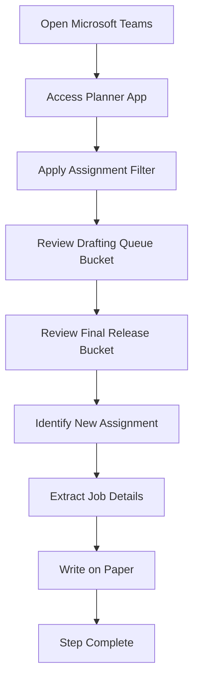

#### Narrative Description
Lee begins each work session by opening Microsoft Teams and accessing the Planner application. He uses filters to view only jobs assigned to him, focusing on two specific buckets: "Drafting Queue" (primary work) and "Final Release to Dee - Drafting" (secondary work). When a new assignment appears, he extracts the essential information - job number, customer name, and location - and records it on paper to carry forward to the next step.

#### Quality Checkpoints
- Verify job assignment notification received
- Confirm job details are complete (number, customer, location)
- Ensure information is legibly recorded

#### Error Handling
- If job details are incomplete, proceed with available information
- If no new assignments, check for updates to existing jobs
- Monitor for due date additions and other changes via notifications

#### Software Integration Details
- **Primary Software**: Microsoft Teams Desktop App
- **Secondary Software**: Microsoft Planner (embedded in Teams)
- **File Management**: Information temporarily stored on paper
- **Collaboration Tools**: Teams notifications for assignment updates
- **Access Method**: Logged in through Microsoft Teams with appropriate permissions

#### File References
- None (information capture step only)

---

### Step 2: Job Folder Navigation and KOM File Access
**Logic Flow Number**: 2
**Department**: Engineering (Drafter Designer III)
**Software Used**: Windows File Explorer, Microsoft Excel
**File Types**: .xlsx (KOM AND OC FORM), .dwg (AutoCAD files)
**Duration**: ~10-15 minutes (varies with network speed)
**Inputs**: Job number, Customer name, City/State from Step 1
**Outputs**: Printed KOM file, Job folder structure confirmed
**Handoff To**: Next step in drafting workflow

#### Step Description
1. Open Windows File Explorer
2. Navigate to "This PC" to locate mapped "Jobs F" network drive
3. Open "Jobs F" folder (drive letter varies per user)
4. Search for customer name (with variations due to inconsistent naming)
5. Open customer folder and search for City, ST location
6. Open location folder and search for job number folder (5-digit format)
7. If job folder exists, open it to find 9 standard folders + KOM file
8. Open KOM AND OC FORM.xlsx file (prefixed with job number)
9. Print KOM file and place in manila folder for reference
10. Verify job folder structure matches standard format

#### Flowchart
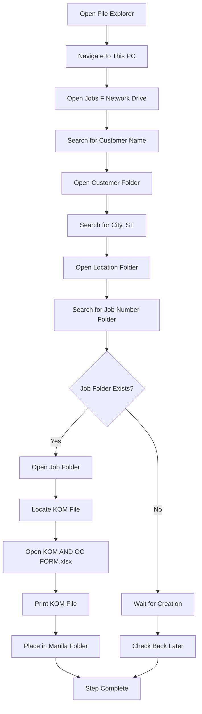

#### Narrative Description
Lee navigates through the network file structure to locate the specific job folder. Due to inconsistent customer naming conventions, he must search through various similar names to find the correct job. Once located, he accesses the job folder containing 9 standard department folders and the KOM file. He opens the KOM file in Excel to extract equipment specifications and prints it for easy reference due to slow network speeds. The printed copy serves as his working reference throughout the drafting process.

#### Quality Checkpoints
- Verify correct customer folder found
- Confirm job number folder exists and is accessible
- Validate KOM file contains required equipment specifications
- Ensure printed copy is legible and complete

#### Error Handling
- If customer name not found, try variations and similar spellings
- If job folder doesn't exist, wait for creation by lead (Pete) or other team member
- If KOM file is corrupted or incomplete, contact sales team for updated version
- If network is too slow, work with printed copy and update as needed

#### Software Integration Details
- **Primary Software**: Windows File Explorer
- **Secondary Software**: Microsoft Excel
- **File Management**: Network drive mapping (varies per user)
- **Network Access**: "Jobs F" mapped drive through Windows
- **File Types**: .xlsx (KOM files), .dwg (AutoCAD files for reference)
- **Performance**: Network speed varies significantly (1.5-2 minutes for .dwg searches)

#### Key KOM File Sections Used
- **EQUIPMENT Section**: HTR-1, HTR-2, STK ECON, STACKS, HR, TANKS, PUMPS, Steam Heaters, SOFTENER, PANELS(S), OTHER
- **Project Type**: FABS (fabrication projects)
- **Equipment Specifications**: Quantities, types, materials, dimensions, flow rates, pressures

#### File References
- KOM AND OC FORM.xlsx (example: 35211 KOM AND OC FORM.xlsx)
- Standard job folder structure with 9 department folders:
  1. Sales
  2. Accounting  
  3. Engineering
  4. Drafting
  5. Purchasing
  6. Manufacturing
  7. Factory Acceptance Test
  8. Service
  9. Warranty Form

---

### Step 3: Sales Proposal Review and Equipment Specification Validation
**Logic Flow Number**: 3
**Department**: Engineering (Drafter Designer III)
**Software Used**: Windows File Explorer, Adobe PDF, Microsoft Word
**File Types**: .pdf, .docx, .xlsx (Proposal documents)
**Duration**: ~15-20 minutes
**Inputs**: KOM file notes, Job folder structure
**Outputs**: Highlighted equipment specs, Printed proposal documents, Temporary job folder
**Handoff To**: Next step in drafting workflow

#### Step Description
1. Highlight and take notes on equipment from KOM file (quantities, specifications, materials)
2. Navigate to "1. Sales" folder within job directory
3. Search for proposal documents (look for "Proposal" in filename)
4. Identify most current proposal using last modified dates and revision IDs
5. Open proposal document (PDF or Word format)
6. Compare sales specifications to engineering specs from KOM file
7. Extract additional information not available in KOM file
8. Print proposal document or take detailed notes
9. Organize printed materials in temporary job folder by job number
10. Flag any discrepancies for resolution through Pete or Project Engineers

#### Flowchart
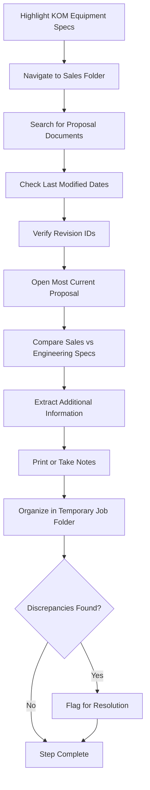

#### Narrative Description
Lee reviews the KOM file to highlight all equipment specifications, then navigates to the Sales folder to locate proposal documents. He uses file modification dates and revision identifiers to find the most current proposal, though the naming conventions vary by salesperson. After opening the proposal, he compares the sales specifications to the engineering specs from the KOM file, looking for additional details that might not be captured in the engineering documentation. He prints the proposal and organizes it with other job materials in a temporary folder for easy reference during drafting.

#### Quality Checkpoints
- Verify most current proposal document identified
- Confirm all equipment specifications highlighted and noted
- Validate sales specs match engineering specs from KOM
- Ensure all critical information extracted and documented

#### Error Handling
- If multiple proposal revisions found, use modification dates and revision logic
- If proposal document missing, proceed with KOM file information
- If discrepancies found, flag for resolution through Pete or Project Engineers
- If unclear which document is current, check with sales team through proper channels

#### Software Integration Details
- **Primary Software**: Windows File Explorer
- **Secondary Software**: Adobe PDF, Microsoft Word
- **File Management**: Temporary job folder organization
- **File Types**: .pdf (proposal PDFs), .docx (proposal Word docs), .xlsx (KOM files)
- **Document Comparison**: Manual review between KOM and proposal specifications

#### Key Information Sources
- **KOM File**: Detailed engineering specifications and part numbers
- **Proposal Documents**: Customer-facing specifications and project details
- **Revision Tracking**: Last modified dates and revision identifiers (R1, R2, etc.)
- **Sales Team Variations**: Different naming conventions per salesperson

#### File References
- Sales folder proposal documents (example: 35211-F Proposal.docx, 35211-F1 Proposal Rv1.docx)
- Temporary job folder for organized materials
- KOM file for engineering specifications comparison

---

### Step 4: Engineering Design and Release Document Review
**Logic Flow Number**: 4
**Department**: Engineering (Drafter Designer III)
**Software Used**: Windows File Explorer, Microsoft Excel, Autodesk Vault, Autodesk Design Assistant 2022
**File Types**: .xlsx (Design releases), .dwg (System drawings), .pdf (Reference documents)
**Duration**: ~20-30 minutes
**Inputs**: KOM file, Sales proposal, Job folder structure
**Outputs**: Engineering specifications, Design releases, System drawings status, Vault project status
**Handoff To**: Next step in drafting workflow

#### Step Description
1. Navigate to "3. Engineering" folder within job directory
2. Open "General Design" folder and locate "Engineering Design" document
3. Open "Releases" folder and locate "Heater Release" and "Mechanical Release" documents
4. Review General Design Specifications for drawing package requirements
5. Review Design Releases for long lead-time items and BOM information
6. Check "4. Drafting/systems" folder for system drawings (HWT, SCHEMATIC FLOW, HTR ASSY, LAYOUT)
7. Verify system drawings are complete and available
8. Check Inventor Vault for project folder structure (CUSTOMER/LOCATION/JOB#/FABS or PACKAGING)
9. Verify Vault contains Inventor drawings/assemblies in FABS, PACKAGING, or SYSTEMS directories
10. If Vault not populated, perform Copy Design process using Design Assistant 2022 or Vault right-click
11. Resolve any discrepancies with Project Engineer (Andy, Bernie, or Tyler)
12. Confirm all necessary specifications and drawings are available

#### Flowchart
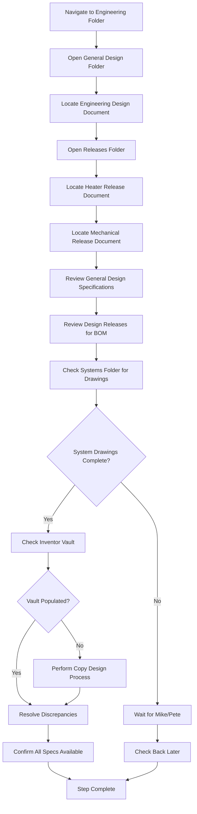

#### Narrative Description
Lee navigates to the Engineering folder to access General Design Specifications and Design Release documents. He locates the "Engineering Design" document and reviews both "Heater Release" and "Mechanical Release" Excel files for long lead-time items and BOM information. He then checks the Systems folder for completed system drawings (HWT, SCHEMATIC FLOW, HTR ASSY, LAYOUT) and verifies the Inventor Vault contains the necessary project files. If the Vault isn't populated, he performs the Copy Design process using Design Assistant 2022 or Vault's right-click functionality. Any discrepancies are resolved through consultation with Project Engineers.

#### Quality Checkpoints
- Verify Engineering Design document located and reviewed
- Confirm Design Release documents contain necessary BOM information
- Validate system drawings are complete and available
- Ensure Vault project folder is properly populated
- Resolve any specification discrepancies

#### Error Handling
- If system drawings not complete, wait for Mike or Pete to finish
- If Vault not populated, perform Copy Design process independently
- If discrepancies found, consult with Project Engineer for resolution
- If documents missing, proceed with available information and flag missing items

#### Software Integration Details
- **Primary Software**: Windows File Explorer, Microsoft Excel
- **Secondary Software**: Autodesk Vault, Autodesk Design Assistant 2022
- **File Management**: Vault project structure (CUSTOMER/LOCATION/JOB#/FABS or PACKAGING)
- **File Types**: .xlsx (Design releases), .dwg (System drawings), .pdf (Reference documents)
- **Vault Access**: Right-click context menu for Copy Design functionality

#### Key Document Types
- **General Design Specifications**: "Engineering Design" documents
- **Design Releases**: "Heater Release" and "Mechanical Release" Excel files
- **System Drawings**: HWT, SCHEMATIC FLOW, HTR ASSY, LAYOUT drawings
- **Vault Structure**: CUSTOMER/LOCATION/JOB#/FABS or PACKAGING directories

#### File References
- Engineering Design - rev 3.5.pdf
- Heater Release v2.17 20250425.pdf
- Mechanical Release 2.01 20250508.pdf
- Vault project folder structure with Inventor drawings/assemblies

---

### Step 5: D365 Product Verification
**Logic Flow Number**: 5
**Department**: Engineering (Drafter Designer III)
**Software Used**: Microsoft Dynamics D365
**File Types**: None (verification only)
**Duration**: ~10-15 minutes
**Inputs**: Job number from previous steps
**Outputs**: Verified product part numbers for drafting package
**Handoff To**: Next step in drafting workflow

#### Step Description
1. Open Microsoft Dynamics D365
2. Navigate to "Modules"
3. Navigate to "Product Information Management"
4. Navigate to "All Projects"
5. Enter Job Number and Click "Project ID"
6. Select Job Number
7. Click "Item Requirements"
8. Make note of the Products needed to create, number and release the Drawing package

#### Flowchart
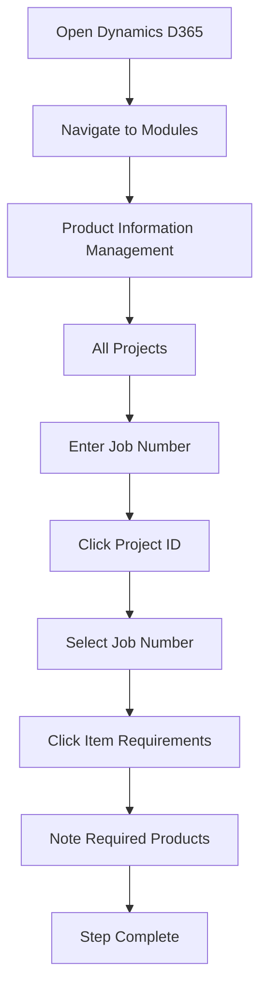

#### Narrative Description
Lee accesses Microsoft Dynamics D365 to verify the product part numbers that need to be created for the drafting package. He navigates through the system to find the specific project and reviews the item requirements to understand what products need to be documented in the drawing package.

#### Quality Checkpoints
- Verify correct job number is entered
- Confirm all required products are identified
- Ensure product information is complete and accurate

#### Error Handling
- If job number not found, verify with project team
- If product information incomplete, contact engineering team
- If system access issues, contact IT support

#### Software Integration Details
- **Primary Software**: Microsoft Dynamics D365
- **Access Method**: Web-based application
- **Data Source**: Project management system
- **Integration**: Links to job assignment and product requirements

---

### Step 6: Rename Inventor Drawings
**Logic Flow Number**: 6
**Department**: Engineering (Drafter Designer III)
**Software Used**: Autodesk Vault
**File Types**: .idw, .iam (Inventor drawings and assemblies)
**Duration**: ~15-20 minutes
**Inputs**: Job number, Engineering Design specifications
**Outputs**: Renamed Inventor drawings with proper part numbers
**Handoff To**: Next step in drafting workflow

#### Step Description
1. Navigate to Inventor Vault Project directory (Job Number)
2. Locate Drawing and right click, choose "Rename"
3. Click "Next"
4. Refer to Engineering Design Sheets for "Can Size"
5. Enter new name (e.g., 35354-01 42X12 HTR) and click "Finish"
6. Review rename results and click "Close"

#### Flowchart
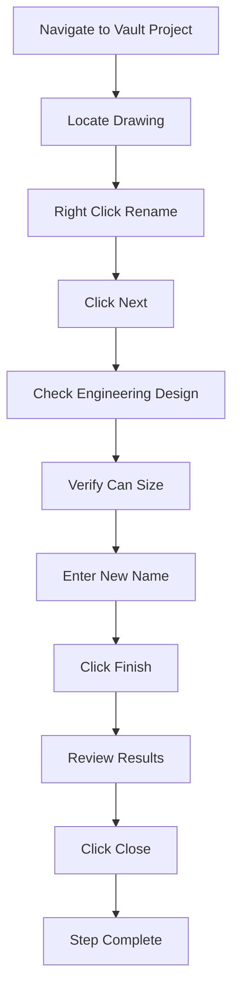

#### Narrative Description
Lee accesses the Inventor Vault to rename the drawing files according to the engineering specifications. He references the printed Engineering Design sheets to determine the correct "Can Size" and creates a properly formatted drawing name that includes the job number, dimensions, and component type.

#### Quality Checkpoints
- Verify correct can size from Engineering Design
- Confirm drawing name follows company naming convention
- Ensure all drawings are properly renamed

#### Error Handling
- If can size unclear, consult with engineering team
- If naming convention issues, refer to company standards
- If Vault access problems, contact IT support

#### Software Integration Details
- **Primary Software**: Autodesk Vault
- **File Types**: .idw (drawings), .iam (assemblies)
- **Naming Convention**: JobNumber-ItemNumber Dimensions ComponentType
- **Reference**: Engineering Design specifications

---

### Step 7: Get/Checkout Inventor Drawings & Assemblies
**Logic Flow Number**: 7
**Department**: Engineering (Drafter Designer III)
**Software Used**: Autodesk Vault
**File Types**: .idw, .iam, .ipt (Inventor files)
**Duration**: ~10-15 minutes
**Inputs**: Renamed drawings from previous step
**Outputs**: Local copies of drawings and assemblies ready for editing
**Handoff To**: Next step in drafting workflow

#### Step Description
1. Checkout proper Drawings/Assemblies within customer vault folder
2. Right Click and Choose "Get" to download local copies
3. Choose Children and Click "OK"
4. Once Downloaded, Right click and choose "Checkout"
5. Verify files are BLUE with Checkmark when checkout complete

#### Flowchart
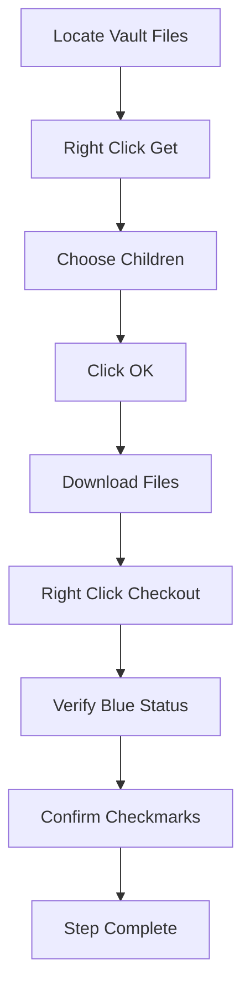

#### Narrative Description
Lee downloads the necessary Inventor files from the Vault to his local workspace. He uses the "Get" function to download all related files including children, then checks them out for editing. The blue color and checkmark indicators confirm the files are ready for local editing.

#### Quality Checkpoints
- Verify all required files are downloaded
- Confirm files show blue status with checkmarks
- Ensure all children files are included

#### Error Handling
- If download fails, check network connection
- If checkout fails, verify file permissions
- If files missing, check Vault folder structure

#### Software Integration Details
- **Primary Software**: Autodesk Vault
- **File Management**: Local workspace synchronization
- **Status Indicators**: Blue color and checkmarks for checked-out files
- **Dependencies**: All children files must be included

---

### Step 8: Open Drawings & Assemblies in Inventor
**Logic Flow Number**: 8
**Department**: Engineering (Drafter Designer III)
**Software Used**: Autodesk Inventor 2022
**File Types**: .idw, .iam, .ipt (Inventor files)
**Duration**: ~5-10 minutes
**Inputs**: Checked-out files from previous step
**Outputs**: Open Inventor files ready for editing
**Handoff To**: Next step in drafting workflow

#### Step Description
1. Open Inventor Application
2. Ensure "KEMCO VAULT" Project is Checked
3. Click the open button
4. Navigate to "Jobs F" directory
5. Locate Customer name, City State, then Job Number
6. Open "4. Drafting" folder, then "Fabs"
7. Select items to open and click "Open"
8. Verify files are open and ready for editing

#### Flowchart
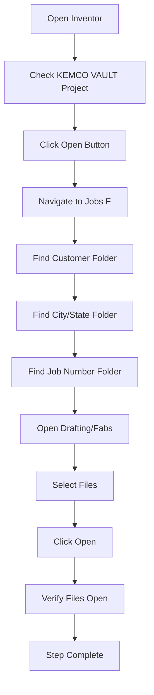

#### Narrative Description
Lee opens Autodesk Inventor and ensures the correct project is selected. He navigates through the file structure to locate the specific job files and opens the necessary drawings and assemblies for editing. The files are now ready for the detailed drafting work.

#### Quality Checkpoints
- Verify correct project is selected
- Confirm all required files are opened
- Ensure files are ready for editing

#### Error Handling
- If project not found, check Vault connection
- If files won't open, verify file integrity
- If navigation issues, check file paths

#### Software Integration Details
- **Primary Software**: Autodesk Inventor 2022
- **Project Management**: KEMCO VAULT project
- **File Structure**: Jobs F/Customer/City-State/JobNumber/Drafting/Fabs
- **File Types**: .idw, .iam, .ipt

---

### Step 9: Heater Setup Drawing Scale/Views & Part Number Assignment
**Logic Flow Number**: 9
**Department**: Engineering (Drafter Designer III)
**Software Used**: Autodesk Inventor 2022, iLogic
**File Types**: .idw (Inventor drawings)
**Duration**: ~20-30 minutes
**Inputs**: Open Inventor files, Engineering specifications
**Outputs**: Properly scaled drawings with assigned part numbers
**Handoff To**: Next step in drafting workflow

#### Step Description
1. Open .idw for current project
2. Adjust view scale to ensure content fits and is readable
3. Open the Heater Assembly
4. Click "Enter Parameters" button in iLogic Forms Panel
5. Go to "Drawing Numbers" tab on Form
6. Edit the Heater Final Assy part number
7. Verify all parameters are correctly set

#### Flowchart
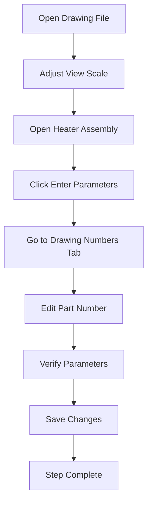

#### Narrative Description
Lee opens the Inventor drawing and adjusts the scale to ensure all content is clearly visible and readable. He then accesses the iLogic forms to enter the proper part numbers and parameters for the heater assembly, ensuring all drawing information is correctly assigned.

#### Quality Checkpoints
- Verify drawing scale is appropriate
- Confirm part numbers are correctly assigned
- Ensure all parameters are properly set

#### Error Handling
- If scale issues, adjust view settings
- If part number errors, verify with engineering specs
- If iLogic issues, check form configuration

#### Software Integration Details
- **Primary Software**: Autodesk Inventor 2022
- **Secondary Software**: iLogic (embedded in Inventor)
- **File Types**: .idw (drawings), .iam (assemblies)
- **Parameter Management**: iLogic forms for part number assignment

---

### Step 10: Assembly Mod Piping View Representation Update
**Logic Flow Number**: 10
**Department**: Engineering (Drafter Designer III)
**Software Used**: Autodesk Inventor 2022
**File Types**: .iam (Inventor assemblies)
**Duration**: ~10-15 minutes
**Inputs**: Heater assembly from previous step
**Outputs**: Updated view representation for modular piping
**Handoff To**: Next step in drafting workflow

#### Step Description
1. Open Heater Assy (ffa.iam)
2. Activate Mod Piping View for editing
3. Exclude Gas Train Assembly from Mod Piping View Representation
4. Verify view representation is correct
5. Save changes

#### Flowchart
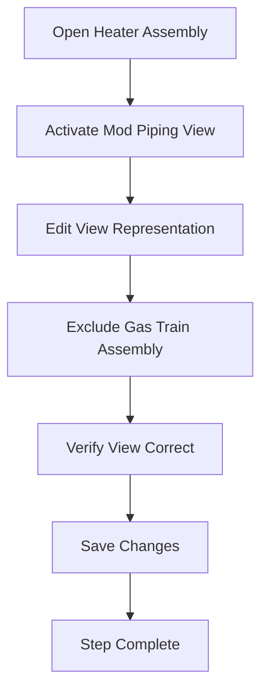

#### Narrative Description
Lee opens the heater assembly and activates the modular piping view for editing. He excludes the gas train assembly from this view representation to ensure the modular piping components are clearly visible and properly documented.

#### Quality Checkpoints
- Verify gas train assembly is excluded
- Confirm modular piping view is clear
- Ensure view representation is correct

#### Error Handling
- If view issues, check assembly structure
- If exclusion fails, verify component hierarchy
- If representation problems, adjust view settings

#### Software Integration Details
- **Primary Software**: Autodesk Inventor 2022
- **File Types**: .iam (assemblies)
- **View Management**: Modular piping view representation
- **Component Control**: Gas train assembly exclusion

---

### Step 11: Mod Piping Assembly Hose Assy Documentation
**Logic Flow Number**: 11
**Department**: Engineering (Drafter Designer III)
**Software Used**: Autodesk Inventor 2022, Microsoft Dynamics D365
**File Types**: .iam (Inventor assemblies), .xlsx (Excel files)
**Duration**: ~20-25 minutes
**Inputs**: Mod piping assembly, D365 product database
**Outputs**: Documented hose assembly with correct part numbers
**Handoff To**: Next step in drafting workflow

#### Step Description
1. Edit Mod Pipe Assembly
2. Measure Hose Length, round to closest inch, then add 3" to length
3. Calculate: 27.096 = 27 + 3 = 30"
4. Open Dynamics D365 and Go to "Released Products"
5. Search for "894-01-*" (Item Number search)
6. Filter for Hose Size and length
7. Select correct Hose Assembly
8. Open Assembly Form and Select "Hose Part Number / Length" tab
9. Enter measured Hose length and update length and Hose Part Number

#### Flowchart
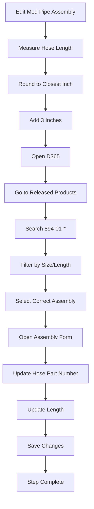

#### Narrative Description
Lee measures the hose length in the modular piping assembly and calculates the required length by rounding to the nearest inch and adding 3 inches for safety. He then searches the D365 product database to find the correct hose assembly part number and updates the assembly form with the proper specifications.

#### Quality Checkpoints
- Verify hose length measurement is accurate
- Confirm correct part number is selected
- Ensure length calculation includes safety margin

#### Error Handling
- If measurement issues, re-measure carefully
- If part number not found, check D365 database
- If form issues, verify assembly configuration

#### Software Integration Details
- **Primary Software**: Autodesk Inventor 2022
- **Secondary Software**: Microsoft Dynamics D365
- **File Types**: .iam (assemblies)
- **Database Integration**: D365 product lookup
- **Calculation**: Length + 3" safety margin

---

### Step 12: Gas Train Assembly/Drawing Initial Setup
**Logic Flow Number**: 12
**Department**: Engineering (Drafter Designer III)
**Software Used**: Autodesk Inventor 2022
**File Types**: .iam, .idw (Inventor assemblies and drawings)
**Duration**: ~25-30 minutes
**Inputs**: Gas train assembly, template drawings
**Outputs**: Initialized gas train drawing with BOM and views
**Handoff To**: Next step in drafting workflow

#### Step Description
1. Open Gas Train Assembly
2. Edit "Pilot Detail" View Representation, activate and edit it
3. Remove all components except Pilot Detail Components
4. Navigate to Gas Train Drawing Sheet
5. Open Gas Train Template Drawing within Customer FABS folder
6. Copy and Paste BOM and Drawing views from template to Customer Job Drawing
7. Repair any broken Balloons/Dimensions
8. Click "Open Data" form and complete form

#### Flowchart
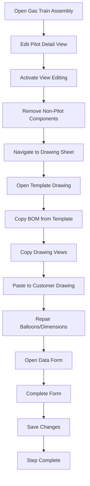

#### Narrative Description
Lee opens the gas train assembly and sets up the pilot detail view by removing unnecessary components. He then accesses the gas train drawing sheet and uses a template drawing to copy the BOM and drawing views to the customer's job drawing. He repairs any broken annotations and completes the data form.

#### Quality Checkpoints
- Verify pilot detail view is correct
- Confirm BOM is properly copied
- Ensure all balloons and dimensions are intact

#### Error Handling
- If view issues, check component visibility
- If BOM problems, verify template structure
- If annotation issues, repair manually

#### Software Integration Details
- **Primary Software**: Autodesk Inventor 2022
- **File Types**: .iam (assemblies), .idw (drawings)
- **Template System**: Gas train template drawings
- **View Management**: Pilot detail view representation

---

### Step 13: Verify Inventor Heater Assembly Form Values
**Logic Flow Number**: 13
**Department**: Engineering (Drafter Designer III)
**Software Used**: Autodesk Inventor 2022, iLogic
**File Types**: .iam (Inventor assemblies)
**Duration**: ~30-40 minutes
**Inputs**: Heater assembly, Engineering documents
**Outputs**: Verified assembly with correct form values
**Handoff To**: Next step in drafting workflow

#### Step Description
1. Open reference files or use printouts
2. Update Ballast Packing Rings
3. Verify All Assembly form Values:
   - Heater Model
   - Location (US, CANADA)
   - Heater Diameter
   - Heater Height (152" / 12 = 12.67ft = 12')
   - Stack Diameter = 18"
   - Application = standard (concrete, not food grade)
   - Material = 304 Stainless (Spray nozzle spec'd as CS)
   - Burner Model (Gas Train) = Maxon #487M
   - Gas Train Position = Left
   - Heater Mounting = Pumped
   - Gauge Cocks = NSF (Standard)
   - Temp Switch Material = Stainless (No brass)
   - Packaging = Modular Piping (Standard)
   - Mod Piping Transducer Material = SS316 Ends (No brass)
   - Modulating Valve = No (Not spec'd)
   - Media Frame Height = 54 Standard
   - Gas = NG

#### Flowchart
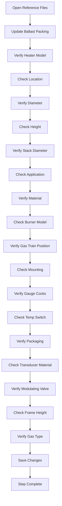

#### Narrative Description
Lee systematically verifies all assembly form values against the engineering documents. He checks each parameter including heater specifications, materials, positioning, and component details to ensure the assembly matches the engineering requirements exactly.

#### Quality Checkpoints
- Verify all form values match engineering specs
- Confirm material selections are correct
- Ensure positioning and dimensions are accurate

#### Error Handling
- If values don't match, update with correct specifications
- If materials incorrect, consult engineering team
- If dimensions wrong, verify calculations

#### Software Integration Details
- **Primary Software**: Autodesk Inventor 2022
- **Secondary Software**: iLogic forms
- **File Types**: .iam (assemblies)
- **Reference Documents**: Engineering specifications
- **Validation**: Cross-reference with printed documents

---

### Step 14: Spray Nozzle and Nipple Size Verify/Update
**Logic Flow Number**: 14
**Department**: Engineering (Drafter Designer III)
**Software Used**: Autodesk Inventor 2022
**File Types**: .iam (Inventor assemblies)
**Duration**: ~20-25 minutes
**Inputs**: Assembly with spray nozzle, Engineering specifications
**Outputs**: Updated spray nozzle with correct size and specifications
**Handoff To**: Next step in drafting workflow

#### Step Description
1. Check Nipple and Spray Nozzle size on Drawing
2. Check Water Inlet Size = 2"
3. Update Spray Nozzle:
   - Select Spray nozzle in Assy model
   - Open Assy Form and click "Replace Spray Nozzle"
   - Select Local working folder
   - Select Libraries
   - Select Fittings
   - Select Spray Nozzles
   - Select Spray Nozzle Size
   - Select Engineering Spec'd Nozzle and click "Open"
4. Update Spray Nozzle Nipple:
   - Select Nipple in Assy Model
   - Click "Change Spray Nozzle Nipple Size"
   - Choose required nipple size and click Okay
   - Pull down on spray nozzle to update constraints
5. Verify Spray Nozzle dimensions between Engineering Values and Model Values

#### Flowchart
```mermaid
graph TD
    A[Check Current Sizes] --> B[Verify Water Inlet = 2"]
    B --> C[Select Spray Nozzle]
    C --> D[Open Assy Form]
    D --> E[Click Replace Spray Nozzle]
    E --> F[Select Local Folder]
    F --> G[Select Libraries]
    G --> H[Select Fittings]
    H --> I[Select Spray Nozzles]
    I --> J[Select Correct Size]
    J --> K[Select Engineering Spec]
    K --> L[Click Open]
    L --> M[Select Nipple]
    M --> N[Change Nipple Size]
    N --> O[Choose Required Size]
    O --> P[Click Okay]
    P --> Q[Update Constraints]
    Q --> R[Verify Dimensions]
    R --> S[Step Complete]
```

#### Narrative Description
Lee checks the current spray nozzle and nipple sizes in the assembly and verifies the water inlet size. He then updates the spray nozzle by selecting the engineering-specified nozzle from the library and updates the nipple size accordingly. He verifies that the dimensions match the engineering specifications.

#### Quality Checkpoints
- Verify water inlet size is 2"
- Confirm correct spray nozzle is selected
- Ensure nipple size matches specifications
- Validate dimensions against engineering values

#### Error Handling
- If sizes incorrect, update with proper specifications
- If nozzle not found, check library availability
- If dimensions don't match, verify engineering specs

#### Software Integration Details
- **Primary Software**: Autodesk Inventor 2022
- **File Types**: .iam (assemblies)
- **Library System**: Spray nozzle and fitting libraries
- **Constraint Management**: Automatic constraint updates
- **Validation**: Engineering specification verification

---

### Step 15: BOM Updates to Heater Final/Modular Piping Sheets
**Logic Flow Number**: 15
**Department**: Engineering (Drafter Designer III)
**Software Used**: Autodesk Inventor 2022, Microsoft Excel
**File Types**: .idw (Inventor drawings), .xlsx (Excel files)
**Duration**: ~20-25 minutes
**Inputs**: Updated assembly from previous step
**Outputs**: Updated BOM with correct component information
**Handoff To**: Next step in drafting workflow

#### Step Description
1. Open BOM in edit mode and expand Heater Mod Piping Assy
2. Hide Mod Pipe Assy
3. Hide All other components not part of Mod Pipe Assy and Click OK
4. Move top view down and adjust BOM column width
5. Hide any blank rows in the BOM
6. Open Heater Final Sheet and open BOM for edits
7. Hide Mod Pipe Assy Parts now displaying after changing Mod Pipe Drawing Sheet BOM
8. Export BOM to Excel file for verifying BOM matches intended BOM from Engineering
9. Save the Drawing

#### Flowchart
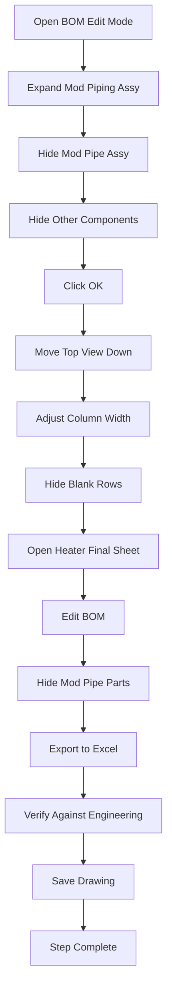

#### Narrative Description
Lee updates the Bill of Materials (BOM) for the heater final and modular piping sheets. He hides unnecessary components, adjusts the layout, and exports the BOM to Excel for verification against the engineering specifications. This ensures the BOM accurately reflects the assembly components.

#### Quality Checkpoints
- Verify BOM shows correct components
- Confirm unnecessary parts are hidden
- Ensure Excel export is complete
- Validate against engineering BOM

#### Error Handling
- If BOM incorrect, check assembly structure
- If export fails, verify Excel availability
- If components missing, check assembly visibility

#### Software Integration Details
- **Primary Software**: Autodesk Inventor 2022
- **Secondary Software**: Microsoft Excel
- **File Types**: .idw (drawings), .xlsx (Excel files)
- **BOM Management**: Component visibility and organization
- **Export Function**: Excel integration for verification

---

### Step 16: Heater Assembly Drawing Creation (.idw)
**Logic Flow Number**: 16
**Department**: Engineering (Drafter Designer III)
**Software Used**: Autodesk Inventor 2022
**File Types**: .idw (Inventor drawings)
**Duration**: ~2-3 hours
**Inputs**: Updated assembly, BOM, Engineering specifications
**Outputs**: Complete heater assembly drawing package
**Handoff To**: Next step in drafting workflow

#### Step Description
**Sheet 1: HEATER FINAL**
- Ensure all TITLEBLOCK FORMS DATA filled out
- Ensure Assembly Part Numbers completed and updated
- Adjust views to conform to clear and legible Drawing practices
- Verify all Balloons exist on sheet in most appropriate view
- Verify BOM is reordered and renumbered
- Verify Note: "ITEMS WITH QUANTITY 0 ARE PURCHASED FROM STEWART STAINLESS AS PART OF ITEM"
- Adjust all centerlines to mate up with components

**Sheet 2: HEATER WELDMENT**
- Adjust views to conform to clear and legible Drawing practices
- Verify all Balloons exist on sheet in most appropriate view
- Verify BOM is reordered and renumbered
- Verify Weld note as WELD OUTSIDE ONLY or WELD INSIDE AND OUTSIDE
- Verify correct COUPLING WELD VIEWS for WELD INSIDE AND OUTSIDE/OUTSIDE ONLY
- Verify Note: "ITEMS WITH QUANTITY 0 ARE PURCHASED FROM STEWART STAINLESS AS PART OF ITEM"
- Verify Leader Note: WELD SEAM DISPLAYS for all appropriate views
- Remove duplicated 0, 90, 180, 270 deg leader callouts
- Adjust all centerlines to mate up with components
- If SUCTION FITTING HEIGHTS not determined, hide and replace with "*"

**Sheet 3: HEATER SHELL**
- Adjust views to conform to clear and legible Drawing practices
- Verify all Balloons exist on sheet in most appropriate view
- Verify BOM is reordered and renumbered
- Verify Note: "ITEMS WITH QUANTITY 0 ARE PURCHASED FROM STEWART STAINLESS AS PART OF ITEM"
- Remove duplicated 0, 90, 180, 270 deg leader callouts
- Adjust all centerlines to mate up with components
- Verify Weld note as WELD OUTSIDE ONLY or WELD INSIDE AND OUTSIDE
- Update Weld symbols for WELDING INSIDE AND OUTSIDE/OUTSIDE ONLY
- If FLATBARS called out separately, verify section views have appropriate balloons

**Sheet 4: HEATER STACK**
- Adjust views to conform to clear and legible Drawing practices
- Verify all Balloons exist on sheet in most appropriate view
- Verify BOM is reordered and renumbered
- Remove duplicated 0, 90, 180, 270 deg leader callouts
- Adjust all centerlines to mate up with components

**Sheet 5: SUCTION FITTING**
- Adjust views to conform to clear and legible Drawing practices
- Verify all Balloons exist on sheet in most appropriate view
- Verify BOM is reordered and renumbered
- Adjust all centerlines to mate up with components

**Sheet 6: GAS TRAIN**
- Adjust views to conform to clear and legible Drawing practices
- Verify all Balloons exist on sheet in most appropriate view
- Verify BOM is reordered and renumbered

**Sheet 7: MODULAR PIPING**
- Adjust views to conform to clear and legible Drawing practices
- Verify all Balloons exist on sheet in most appropriate view
- Verify BOM is reordered and renumbered

#### Flowchart
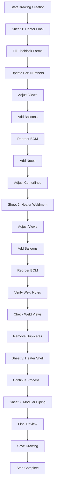

#### Narrative Description
Lee creates a comprehensive heater assembly drawing package with seven detailed sheets. Each sheet focuses on specific components (heater final, weldment, shell, stack, suction fitting, gas train, modular piping) with proper views, balloons, BOMs, and annotations. He ensures all drawing standards are met and all information is clearly presented.

#### Quality Checkpoints
- Verify all titleblock information is complete
- Confirm all part numbers are correct
- Ensure all views are clear and legible
- Validate all balloons are properly placed
- Check BOM is complete and renumbered
- Verify all notes and annotations are correct

#### Error Handling
- If titleblock incomplete, fill in missing information
- If part numbers wrong, update with correct numbers
- If views unclear, adjust scale or positioning
- If balloons missing, add appropriate callouts

#### Software Integration Details
- **Primary Software**: Autodesk Inventor 2022
- **File Types**: .idw (drawings)
- **Drawing Standards**: Company-specific drawing practices
- **BOM Management**: Automatic renumbering and organization
- **Annotation System**: Balloons, dimensions, and notes

---

### Step 17: Print Drawings & Export BOM
**Logic Flow Number**: 17
**Department**: Engineering (Drafter Designer III)
**Software Used**: Autodesk Inventor 2022, Microsoft Excel
**File Types**: .idw (Inventor drawings), .xlsx (Excel files)
**Duration**: ~15-20 minutes
**Inputs**: Complete drawing package from previous step
**Outputs**: Printed drawings and exported BOM for verification
**Handoff To**: Next step in drafting workflow

#### Step Description
1. Print out Full size Drawing package
2. Export Inventor Drawing BOM to excel using iLogic Export command buttons
3. Save Exported BOM to Customers Jobs folder for project job number
4. Verify all drawings printed correctly
5. Confirm BOM export is complete

#### Flowchart
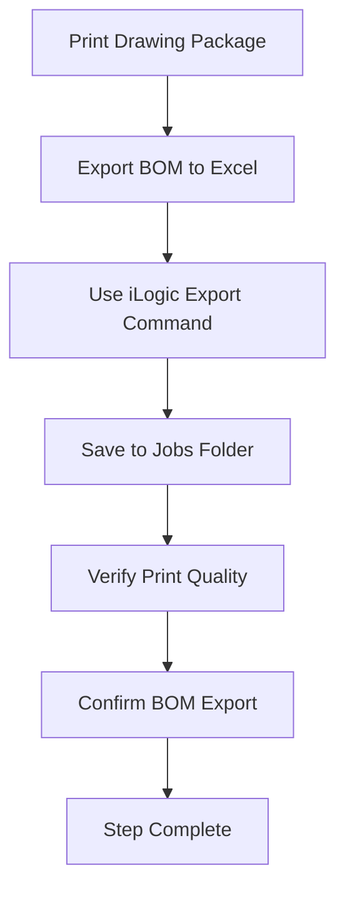

#### Narrative Description
Lee prints the complete drawing package at full size for review and exports the BOM to Excel using the iLogic export functionality. He saves the exported BOM to the customer's job folder for verification against the engineering long lead BOM.

#### Quality Checkpoints
- Verify all drawings printed at correct scale
- Confirm BOM export is complete
- Ensure files saved to correct location

#### Error Handling
- If print issues, check printer settings
- If export fails, verify iLogic configuration
- If save problems, check folder permissions

#### Software Integration Details
- **Primary Software**: Autodesk Inventor 2022
- **Secondary Software**: Microsoft Excel, iLogic
- **File Types**: .idw (drawings), .xlsx (Excel files)
- **Export Function**: iLogic BOM export commands
- **File Management**: Customer job folder organization

---

### Step 18: Export Inventor BOM for D365
**Logic Flow Number**: 18
**Department**: Engineering (Drafter Designer III)
**Software Used**: Autodesk Inventor 2022, Microsoft Excel
**File Types**: .idw (Inventor drawings), .xlsx (Excel files)
**Duration**: ~20-25 minutes
**Inputs**: Complete drawing package, BOM data
**Outputs**: D365-compatible BOM export
**Handoff To**: Next step in drafting workflow

#### Step Description
1. Open Inventor .idw that needs BOM exported
2. Close default forms that open up
3. Click on "EXPORT BOM FOR DYNAMICS"
4. If error occurs, close previously opened excel file before running again
5. Excel file should open automatically
6. Select all tabs in excel spreadsheet
7. Press CTRL+P to print preview
8. Click "Page Setup" -> "Header/Footer" tab
9. Click "Custom Header" button
10. Insert Tab name below filename
11. Click Okay, then Okay to close Page setup
12. Print to choice of printers
13. Click "File" -> "Save as"
14. Click "Browse" then choose "Jobs" directory
15. Choose Customer directory -> Customer City & State -> Job number -> Drafting
16. Choose proper Folder for job -> "Save"

#### Flowchart
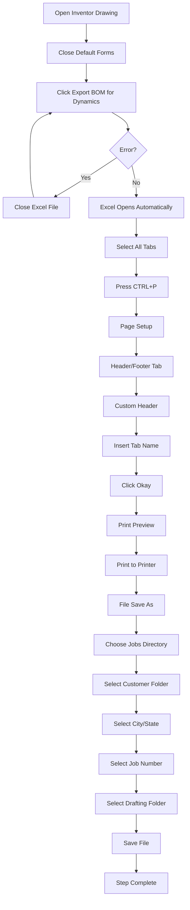

#### Narrative Description
Lee exports the BOM from Inventor in a format compatible with Microsoft Dynamics D365. He uses the specialized export function, formats the Excel output with proper headers, and saves it to the appropriate customer job folder for integration with the D365 system.

#### Quality Checkpoints
- Verify export function works correctly
- Confirm Excel formatting is proper
- Ensure file saved to correct location
- Validate BOM data is complete

#### Error Handling
- If export fails, close Excel and retry
- If formatting issues, adjust header settings
- If save problems, check folder permissions

#### Software Integration Details
- **Primary Software**: Autodesk Inventor 2022
- **Secondary Software**: Microsoft Excel, Microsoft Dynamics D365
- **File Types**: .idw (drawings), .xlsx (Excel files)
- **Export Function**: D365-specific BOM export
- **Integration**: D365 system compatibility

---

## Cross-Discipline Handoffs
[Document how this role interacts with other disciplines]

## Process Dependencies
[What must be completed before this workflow can start]

## Success Criteria
[How to know the workflow is complete and successful]

## Notes for Software Development
[Technical considerations for future software implementation]
